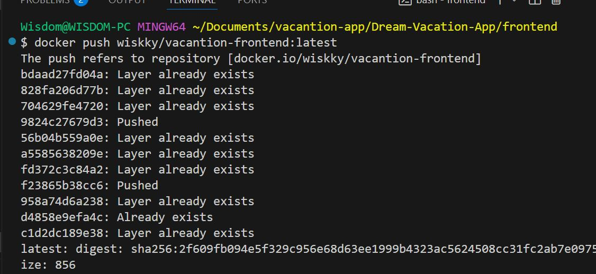
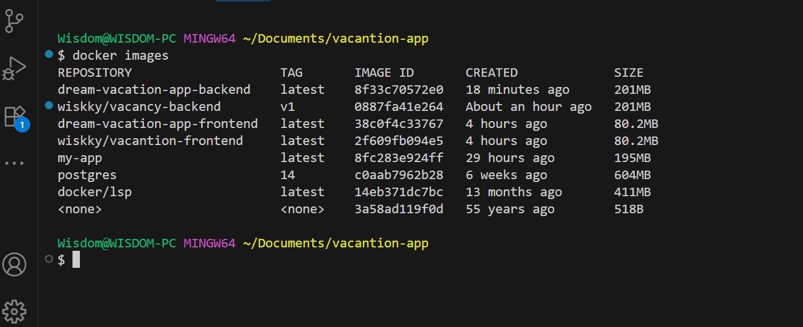

# Dream-Vacation-App
The Dream-Vacation-App is a full-stack web application that helps users explore vacation destinations, built with a React frontend, Node.js backend, PostgreSQL database, and fully containerized using Docker and Docker Compose.

**Ensure required packages are installed**  
Install react, react-dom, react-scripts, axios

**You can build frontend and backend separately by using docker build command. Also you can also use docker-compose command to buuild and run both rontend and backend with the databbase together.**    
**Note:** We use postgress database 

**To build frontend, kindly use**  
`# docker build . -t vacantion-frontend:latest `  

You must run this command where the Dockerfile is located

**To push this to docker hub, we need to tag our image**  
`# docker build . -t wiskky/vacantion-frontend:latest` 

You can check your image by running     
`# docker images`  

To containarize your docker image, run 
`# docker run -d -p 80:80 wiskky/vacancy-frontend`

Note wiskky is my docker hub username, change it to your own docker hub username. 

Then run `# docker ps`

  

On your broswer, type http:localhost

To push your image into docker hub, Then run 

`# docker push wiskky/vacantion-frontend:latest` 

Login into your docker hhub accont and check 

**NOTE** For backend ollow the same step aove to run docker build command and push.

# Using docker compose to containerize your application

To run your docker compose, use the below command
`# docker-compose up --build`

After finish running, then check yyour image and the container
` # docker images`

  

You will notice that, two images are added dream-vacantion-backend and dream-vacantion-frontend.

Also, check if your container is running  
`# docker ps`  

  

Now go to your browser and check yyour application if it is running  

`http://localhost:3000`  

  

# Automate the continuous integration using github Action  

## The aim is to use GitHub Action to build our application and push them as a Docker images with Buildx into  docker hub.

In other to achieve this, on your github on the application repository, click on `Action` and this will create a directory called ./github/worflow/<anyname.yml> 

Let us start with frontend app,  I created ./github/workflow/frontend-cicd.yml

After finish building, you will see this 

  

  

  

Click on build to see your workflow, If any steps failed, you will see it here and clisk to see the reason it fails. 

Then go to hub.docker.com to comfirm to check.

  

  

On this workflow directory ./github/workflow/ create backend-cicd.yml for backend app.

  

 

Then check the docker hub  

  

  
